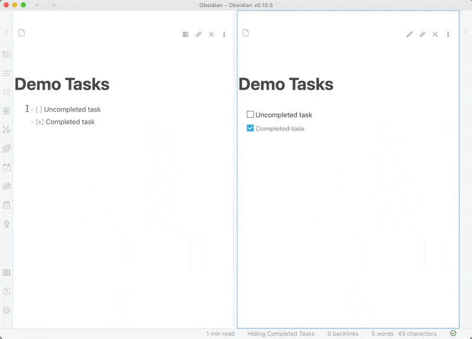

# Completed Task Display

An [Obsidian](https://obsidian.md) plugin that allows you to toggle the visibility of completed tasks globally across your vault.

## Features

- **Toggle completed tasks** - Hide or show completed `[x]` tasks with a single click
- **Ribbon button** - Quick access from the Obsidian ribbon
- **Command palette** - Use `Toggle Completed Task View` command
- **Status bar indicator** - Shows current state (Hiding/Showing Completed Tasks)
- **Settings panel** - Configure status bar visibility and sub-bullet hiding
- **Hide sub-bullets** - Optionally hide indented items beneath completed tasks (Edit/Live Preview mode only)
- **Persistent state** - Remembers your preferences between sessions
- **Custom task status support** - Only hides `[x]` and `[X]`, preserving custom statuses like `[?]`, `[!]`, `[/]`
- **Cross-platform** - Works on desktop and mobile

### Demo



## Installation

### From Obsidian Community Plugins

1. Open Obsidian Settings
2. Go to `Community Plugins` and disable `Restricted mode`
3. Click `Browse` and search for "Completed Task Display"
4. Click `Install`, then `Enable`

### Manual Installation

1. Download the [latest release](https://github.com/heliostatic/completed-task-display/releases/latest)
2. Extract the files into `<vault>/.obsidian/plugins/completed-task-display/`
3. Reload Obsidian
4. Enable the plugin in Settings > Community Plugins

## Usage

### Toggle Completed Tasks

**Using the Ribbon:**
- Click the tasks icon in the left ribbon

**Using Command Palette:**
- Press `Ctrl/Cmd + P`
- Search for "Toggle Completed Task View"

**Status Bar:**
- Check the status bar at the bottom to see current state

### Supported Task Formats

The plugin only hides truly completed tasks:
- `[x]` - Completed (hidden)
- `[X]` - Completed (hidden)

All other task statuses remain visible:
- `[ ]` - Uncompleted
- `[?]` - Possible task
- `[!]` - Urgent task
- `[/]` - In-progress task
- `[-]` - Cancelled task
- Any other custom status

### Settings

Access settings via Settings → Community Plugins → Completed Task Display:

**Show status bar message**
- Toggle the status bar indicator on/off
- Shows "Hiding/Showing Completed Tasks" in the status bar

**Hide sub-bullets** (Edit/Live Preview mode only)
- When enabled, hides indented items (sub-bullets) beneath completed tasks
- Only works in Edit and Live Preview modes
- In Reading view, sub-bullets are automatically hidden with their parent task
- Useful for cleaning up nested task lists while editing

## Development

### Prerequisites

- Node.js 20.x or later
- npm
- An Obsidian vault for testing

### Setup

1. **Clone the repository:**
   ```bash
   git clone https://github.com/heliostatic/completed-task-display.git
   cd completed-task-display
   ```

2. **Install dependencies:**
   ```bash
   npm install
   ```

3. **Build the plugin:**
   ```bash
   npm run build
   ```

### Development Workflow

1. **Link to your test vault:**
   ```bash
   # Create a symlink to your vault's plugins folder
   ln -s /path/to/completed-task-display /path/to/vault/.obsidian/plugins/completed-task-display
   ```

2. **Start development mode:**
   ```bash
   npm run dev
   ```
   This will watch for changes and rebuild automatically.

3. **Reload the plugin in Obsidian:**
   - Open Command Palette (`Ctrl/Cmd + P`)
   - Run "Reload app without saving"
   - Or manually disable and re-enable the plugin

### Project Structure

```
completed-task-display/
├── main.ts           # Main plugin code
├── styles.css        # Plugin styles
├── manifest.json     # Plugin manifest
├── versions.json     # Version compatibility mapping
├── package.json      # NPM dependencies
├── tsconfig.json     # TypeScript configuration
└── rollup.config.js  # Build configuration
```

### Building

- **Development build:** `npm run dev` (watches for changes)
- **Production build:** `npm run build`

### Testing

1. Copy built files to a test vault:
   ```bash
   cp main.js manifest.json styles.css /path/to/vault/.obsidian/plugins/completed-task-display/
   ```

2. Reload Obsidian and test:
   - Toggle completed tasks on/off
   - Test with various task statuses
   - Verify state persistence after restart

## Technical Details

### Compatibility

- **Obsidian API**: v1.10.0
- **Minimum Obsidian Version**: 0.10.0
- **Node.js**: 20.x (for development)
- **TypeScript**: 5.9.3

### How It Works

The plugin uses CSS classes to toggle visibility:
1. Adds `hide-completed-tasks` class to document body when active
2. CSS selectors target completed tasks in both Reading and Edit modes
3. State is persisted using Obsidian's data storage API

### Dependencies

**Runtime:**
- Obsidian API (provided by Obsidian)

**Development:**
- TypeScript 5.9.3
- Rollup 4.52.5
- Various Rollup plugins for bundling

See `package.json` for complete dependency list.

## Contributing

Contributions are welcome! Please see [CONTRIBUTING.md](CONTRIBUTING.md) for guidelines.

### Reporting Issues

- Check [existing issues](https://github.com/heliostatic/completed-task-display/issues) first
- Use issue templates when available
- Include Obsidian version and plugin version
- Provide steps to reproduce bugs

### Pull Requests

- Fork the repository
- Create a feature branch
- Follow the existing code style
- Test your changes thoroughly
- Update documentation as needed
- Submit a pull request with a clear description

## License

MIT License - see [LICENSE](LICENSE) file for details.

## Changelog

### v1.0.7 (2025-10-21)
- 🐛 Fix: Only hide `[x]` and `[X]` tasks, not all custom statuses
- Fixes support for Tasks plugin custom statuses
- Resolves issues #3, #13, #19

### v1.0.6 (2025-10-21)
- 🐛 Fix: CSS syntax error
- 🐛 Fix: Error handling for corrupted data
- 🐛 Fix: Line number display in edit mode (#28)
- 🔧 Update package.json metadata
- 🚀 Modernize dependencies (TypeScript 5.9.3, Rollup 4.52.5)
- 🚀 Modernize GitHub Actions workflow
- 📄 Add MIT LICENSE file

### v1.0.5
- State persistence between sessions

See [full changelog](https://github.com/heliostatic/completed-task-display/releases) for all versions.

## Credits

Created by [Ben Lee-Cohen](https://github.com/heliostatic)

## Support

- [Report a bug](https://github.com/heliostatic/completed-task-display/issues/new)
- [Request a feature](https://github.com/heliostatic/completed-task-display/issues/new)
- [View documentation](https://github.com/heliostatic/completed-task-display)
