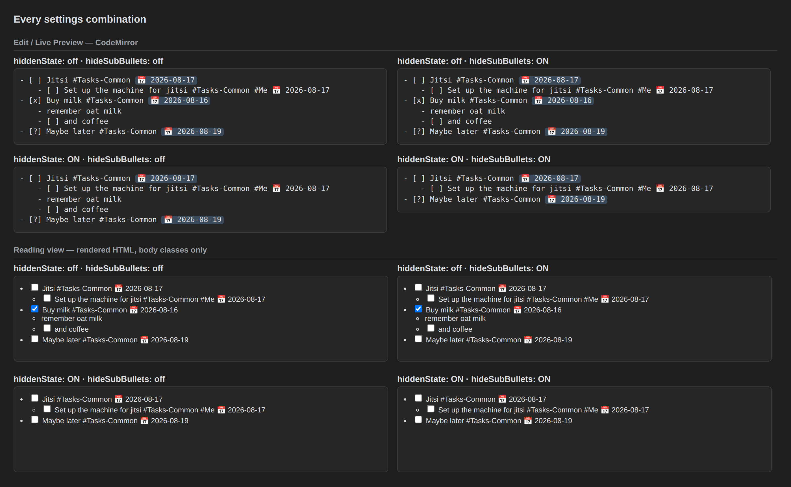

# Visual harness

Renders the plugin's edit-mode hiding in a real browser so it can be checked
with eyes, not just with assertions over the decoration set. Issue #38 was a
CSS bug that no amount of decoration-level testing would have caught: the
decorations were right, the stylesheet hid the wrong lines.

`obsidian-sim.ts` puts CodeMirror into a DOM shaped like Obsidian's editing
mode — `.cm-line.HyperMD-task-line[data-task]`, atomic
`contenteditable="false"` widgets for content other plugins render (a Tasks due
date pill), optional `<label>` checkboxes, and raw text on the line holding the
cursor. `legacy.ts` / `legacy.css` are the 1.0.11 behaviour, copied from commit
dc7cc5f, so the bug and the fix render side by side.


## Settings coverage

`settings.html` renders every combination of the two display settings, in both
modes the plugin touches — Edit/Live Preview, where hiding is CodeMirror
decorations plus the `.ctd-hidden-line` rule, and Reading view, which is plain
rendered HTML driven only by the `hide-completed-tasks` / `hide-sub-bullets`
body classes. (`showStatusBar` is left out: it only decides whether the plugin
asks Obsidian for a status bar item, and changes nothing about the note.)



Reading view drops a completed task's sub-bullets whether or not
`hideSubBullets` is on, because they are nested inside the `<li>` being hidden.
Edit mode keeps them unless the setting is on. That asymmetry is longstanding
and is called out in the README and the setting's own description.

## Running it

```bash
npx vite --config harness/vite.config.ts     # http://localhost:5199
```

The capture scripts need Playwright, which is deliberately not a dependency of
this repo — install it only when you want screenshots:

```bash
npm install --no-save playwright && npx playwright install chromium

node harness/shoot.mjs harness/screenshots/panes.png   # bug vs fix, every pane
node harness/drive.mjs /tmp                            # toggle, edit, arrow keys
node harness/matrix.mjs harness/screenshots/settings-matrix.png   # settings matrix
```

Both scripts print what the browser measured — which lines have zero height,
where the gutter numbers sit, where the cursor lands. `drive.mjs` additionally
exercises the paths a user hits at runtime: reconfiguring the settings
compartment (the ribbon toggle), completing a task while hiding is on, and
arrowing down across a hidden line. `matrix.mjs` also flips `hideSubBullets` on
an already-open editor, which is what the settings tab does.

The editor here is the real thing: CodeMirror 6.38.6 with `@codemirror/state`
6.5.0, the versions the `obsidian` package pins as peer dependencies. What is
simulated is Obsidian's own decorations and markup around it.

If a browser is already on the machine, point Playwright at it instead:
`chromium.launch({ executablePath: ... })`, as the scripts do here.
